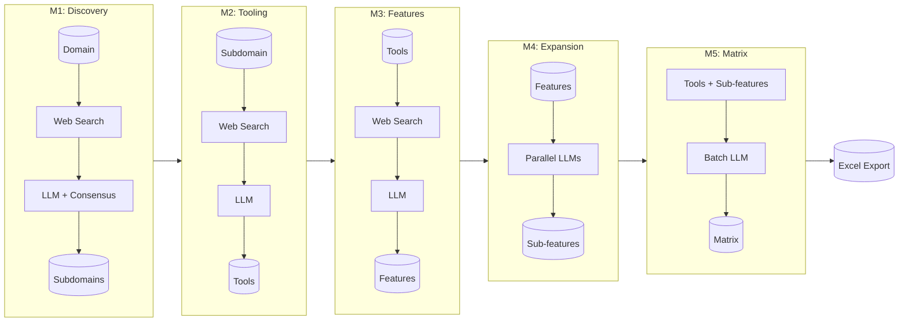
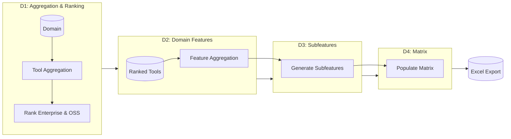
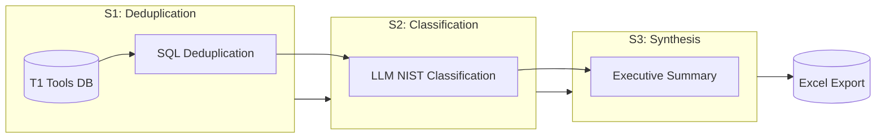
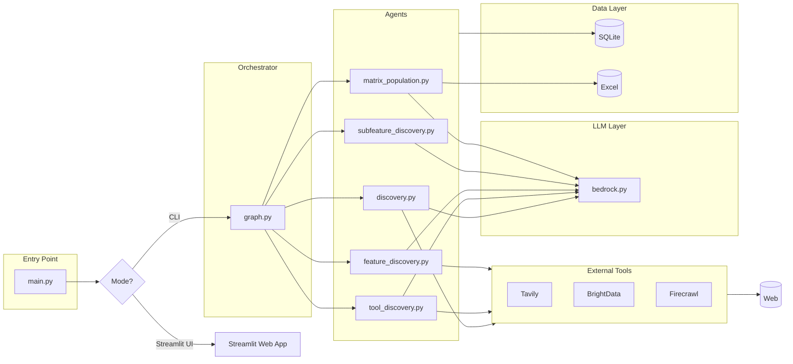

# Cybersec Research Agent


An AI-powered research pipeline that automates cybersecurity tool discovery, feature extraction, and comparison matrix generation.

## Overview

The Cybersec Research Agent is an advanced analytical engine that systematically investigates 19 cybersecurity domains. It utilizes multi-agent LLM pipelines across three distinct research techniques to discover subdomains, rank industry tools, extract differentiating features, and classify them against industry frameworks (NIST CSF 2.0).

## Research Techniques

The agent employs three distinct pipelines to analyze the cybersecurity tooling landscape at varying depths.

### Technique 1: Subdomain Feature Matrix (M1–M5)
Focuses on granular analysis at the subdomain level. It discovers specific subdomains, identifies relevant tools, extracts granular features, and generates comprehensive Excel comparison matrices.



### Technique 2: Domain-Level Tool Rankings (D1–D5)
Operates at the broader domain level. It aggregates and ranks enterprise and open-source tools across an entire domain, generating high-level features and a unified domain matrix.



### Technique 3: Cross-Domain Tool Classification (S1–S3)
Provides global insights by deduplicating tools across all domains and classifying them according to the NIST Cybersecurity Framework (Identify, Protect, Detect, Respond, Recover, Govern).



## Architecture



## Prerequisites

| Service | Purpose | Required |
|---------|---------|----------|
| AWS Bedrock | LLM inference (DeepSeek v3.2) | Yes |
| Tavily API | Primary web search | Yes |
| BrightData API | Fallback SERP | Optional |
| Firecrawl API | Web scraping | Optional |

## Installation

```bash
# Clone the repository
git clone <repo-url>
cd cybersec-research-agent

# Install dependencies (using uv)
uv sync

# Or using pip
pip install -r requirements.txt
```

## Configuration

Create a `.env` file from the example:

```bash
cp .env.example .env
```

| Variable | Description | Default |
|----------|-------------|---------|
| `AWS_REGION` | AWS region for Bedrock | `us-east-1` |
| `BEDROCK_MODEL_ID` | Model identifier | `deepseek.v3.2` |
| `TAVILY_API_KEY` | Tavily search API key | Required |
| `BRIGHTDATA_API_KEY` | BrightData SERP API key | Optional |
| `FIRECRAWL_API_KEY` | Firecrawl scraping API key | Optional |
| `DB_PATH` | SQLite database path | `data/agent.db` |
| `EXCEL_OUTPUT_PATH` | Output Excel file | `output/cybersec_matrix.xlsx` |
| `MAX_WORKERS` | Parallel subdomain pipelines | `3` |
| `LOG_DIR` | Log directory | `logs/` |
| `LOG_DISPLAY_LINES` | Lines to show in log panel | `100` |

## Usage

### Interactive Mode (Streamlit Web UI)

```bash
python main.py
# or explicitly
python main.py --mode streamlit
```

The Streamlit web interface provides:
- **Domain Explorer** - Navigate and manage cybersecurity domains/subdomains
- **Active Pipelines** - Monitor running research pipelines in real-time
- **Logs Panel** - View session logs with auto-refresh
- **Documentation** - Built-in README viewer with interactive Mermaid diagrams

#### Streamlit UI Features

| Feature | Description |
|---------|-------------|
| Domain Tree | Collapsible treeview with checkboxes for bulk operations |
| Detail Panel | Master-detail view for domains and subdomains |
| Pipeline Progress | Live progress bars with stage indicators (M2-M5) |
| Bulk Actions | Run, export, or clear multiple subdomains |
| Documentation Modal | View README with rendered Mermaid diagrams |

### Discover Subdomains

```bash
python main.py --mode discover --domain "Network Security"
```

### Process Single Subdomain

```bash
python main.py --mode single --domain "Network Security" --subdomain "Firewall Management"
```

### Batch Processing

```bash
python main.py --mode batch --domains "Network Security" "Cloud Security" "DevSecOps"
```

## Supported Domains

The agent covers 19 cybersecurity domains:

| | | | |
|---|---|---|---|
| Network Security | Application Security | Cloud Security | Endpoint Security |
| DevSecOps | Identity & Access Management | GRC | Security Operations (SOC) |
| Threat Intelligence | Malware Analysis | Incident Response | OT/ICS Security |
| Mobile Security | AI Security | Cryptography | Information Security |
| Cyber Defense | Digital Forensics | Offensive Security | |

## Output

The pipeline generates distinct Excel reports for each research technique, driven by a unified local database:

- **`data/agent.db`** - Comprehensive SQLite database storing all discovered entities, rankings, and cross-domain classifications.
- **`output/cybersec_matrix.xlsx`** (Technique 1) - Detailed workbook containing tool-feature matrices per subdomain, with support levels: ✔ (Full), Partial, ✘ (None).
- **`output/technique2_domain_rankings.xlsx`** (Technique 2) - Domain-level tool rankings and broader feature comparisons.
- **`output/technique3_tool_classification.xlsx`** (Technique 3) - Global cross-domain tool classification mapping (NIST CSF 2.0), interactive dashboard, and executive summary.

## License

MIT License
